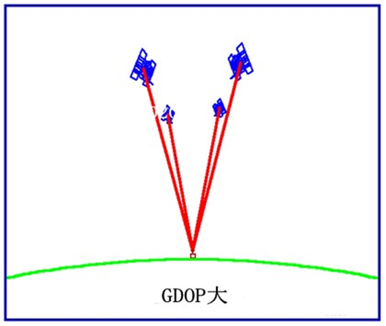
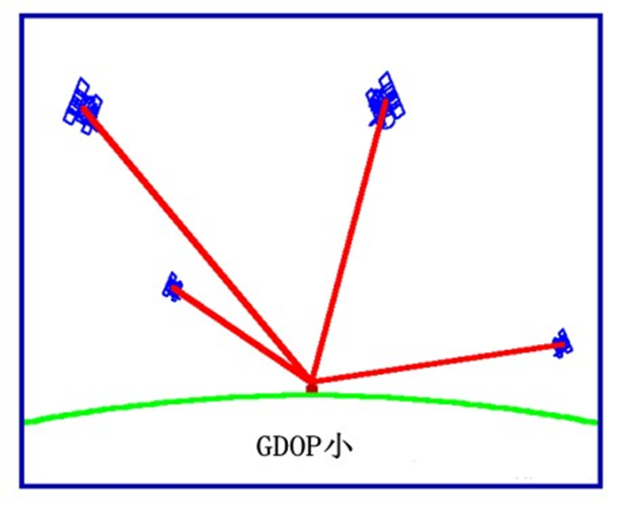

- 只利用一台GPS[[接收机]]直接确定观测站在[[WGS-84大地坐标系|地心地固坐标系]]中的绝对坐标的一种定位方法，也叫绝对定位。
### 分类
- 标准单点定位(SPP)
	- [[伪距测量|伪距观测值]]
	- [[广播星历]]
	- 粗略[[误差源|误差]]模型
- [[精密单点定位|精密单点定位(PPP)]]
	- [[伪距测量|伪距]]和[[载波相位测量|相位观测值]]
	- [[精密星历]]
	- 精密[[误差源|误差]]模型

### 公式

- $P^{i} = \sqrt{(X_s^i-X)^2+(Y_s^i-Y)^2+(Z_s^i-Z)^2} + c(dt_R - dt_s^i)$
- $P_0^i = R_0^i - \frac{X_s^i-X_0}{R_0^i} dX - \frac{Y_s^i-Y_0}{R_0^i} dY - \frac{Z_s^i-Z_0}{R_0^i} dZ + dt_{RC} - cdt_s^i$
- 至少需要4条观测方程（4颗卫星）

### 精度评估

- 验后单位权中误差$m_0=\sqrt{\frac{V^{T} V}{n-l}}$

- 方差阵：$D_{\hat{x}\hat{x}} = m_0^2(B^T B)^{-1} = m_0^2 Q_{\hat{x}\hat{x}}$

- 协因数阵：$Q_{\hat{x}\hat{x}} = \begin{bmatrix} q_{XX} & q_{XY} & q_{XZ} & q_{Xt} \\ q_{YX} & q_{YY} & q_{YZ} & q_{Yt} \\ q_{ZX} & q_{ZY} & q_{ZZ} & q_{Zt} \\ q_{tX} & q_{tY} & q_{tZ} & q_{tt} \end{bmatrix}$
	- 精度因子：
		- $m_X = m_0 \sqrt{q_{XX}}$
		- $m_Y = m_0 \sqrt{q_{YY}}$
		- $m_Z = m_0 \sqrt{q_{ZZ}}$
		- $m_t = m_0 \sqrt{q_{tt}}$
		- $m_{pos} = m_0 \sqrt{q_{XX} + q_{YY} + q_{ZZ}}$
	
- 站心坐标系中的精度计算

	- $\begin{bmatrix} \mathrm{d}N \\ \mathrm{d}E \\ \mathrm{d}U \end{bmatrix} = \begin{bmatrix} -\sin B \cos L & -\sin B \sin L & \cos B \\ -\sin L & \cos B & 0 \\ \cos B \cos L & \cos B \sin L & \sin B \end{bmatrix} \begin{bmatrix} \mathrm{d}X \\ \mathrm{d}Y \\ \mathrm{d}Z \end{bmatrix}$
	- $Q_{NEU} = K Q_{XYZ} K^T = \begin{bmatrix} q_{NN} & q_{NE} & q_{NU} \\ q_{EN} & q_{EE} & q_{EU} \\ q_{UN} & q_{UE} & q_{UU} \end{bmatrix}$
		- 精度因子
			- $m_N = m_0 \sqrt{q_{NN}}$
			- $m_E = m_0 \sqrt{q_{EE}}$
			- $m_U = m_0 \sqrt{q_{UU}}$
			- $m_H = m_0 \sqrt{q_{NN} + q_{EE}}$

- 几何精度因子：$GDOP = \sqrt{q_{XX}+q_{YY}+q_{ZZ}+q_{tt}}$
- 位置精度因子：$m_{pos} = m_0 \sqrt{q_{XX}+q_{YY}+q_{ZZ}} = m_0 \cdot PDOP$ ^fdcbf4
- 时间精度因子：$m_{t} = m_0 \sqrt{q_{tt}} = m_0 \cdot TDOP$
- 水平精度因子：$m_{H} = m_0 \sqrt{q_{NN}+q_{EE}} = m_0 \cdot HDOP$
- 垂直精度因子：$m_{V} = m_0 \sqrt{q_{UU}} = m_0 \cdot VDOP$
	
- DOP值仅取决于卫星数及站星几何关系
-   